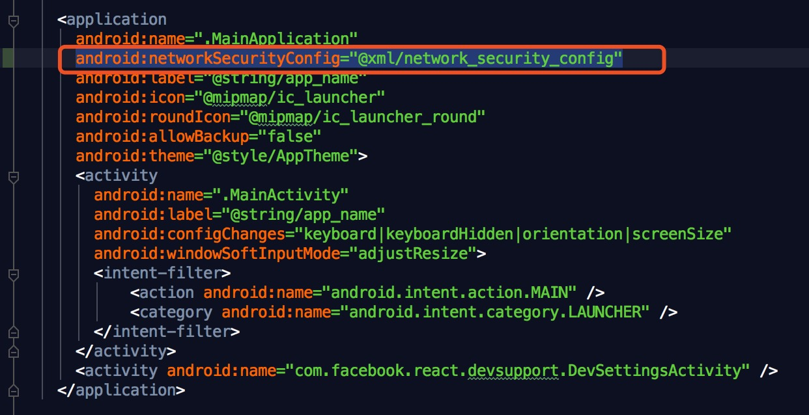
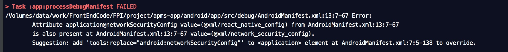

#### 一、android 真机调试 （MAC）

1. 下载SDK并设置好SDK环境变量

    mac终端输入：vi ~/.bash_profile
    添加路径：export PATH=/Users/XXX/Library/Android/sdk/platform-tools:$PATH
    
    立刻生效: $ source ~/.bash_profile
    
    
2. android设备通过USB数据线连接mac

3.mac终端输入：system_profiler SPUSBDataType

4.修改adb_usb.ini文件。mac终端输入：vi ~/.android/adb_usb.ini
  输入i进入vi编辑模式，添加Product ID，按esc退出编辑，:wq!保存退出。

5.关掉服务，重新连接

    adb kill-server
    
    adb start-server

#### 二、android版本过高，导致网络请求无效

1.在 android/app/src/main/res 新建 xml 文件夹（如果已存在，则忽略新建），在此文件夹（xml）下新建文件 network_security_config.xml

network_security_config.xml 文件内容

    <?xml version="1.0" encoding="utf-8"?>
    <network-security-config>
        <base-config cleartextTrafficPermitted="true" />
    </network-security-config>
    
    
    
2.更改 android/app/src/main/AndroidManifest.xml，在清单文件application中加入

    android:networkSecurityConfig="@xml/network_security_config"
    

如下图：

 
    
    
3.再次打包项目可能出现问题：

###### 解决方案

删除 android/app/src/debug 文件，再次运行打包项目

