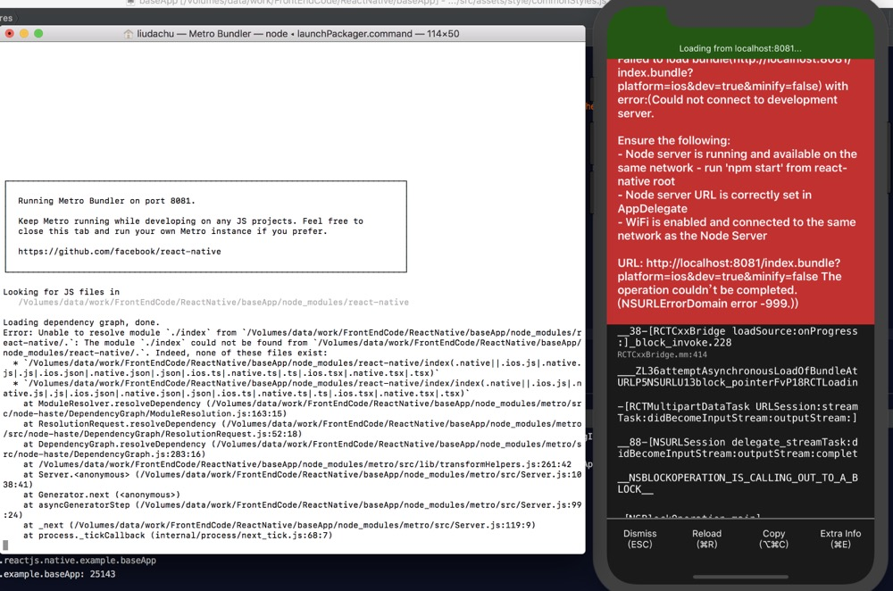
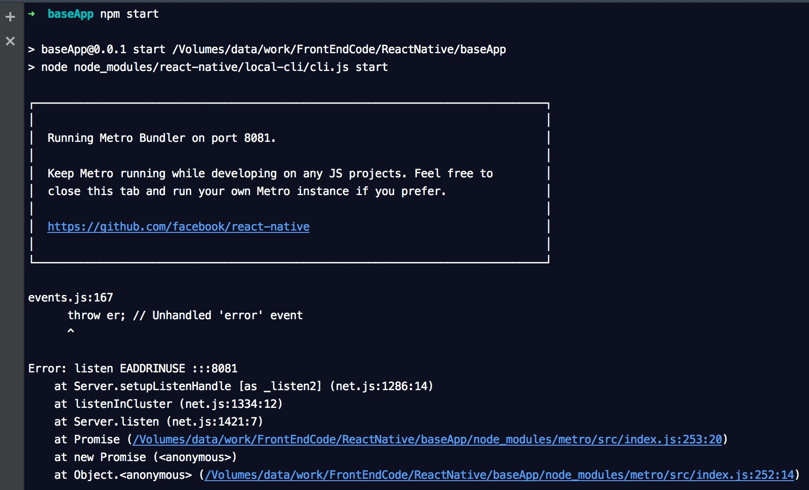

###### 1.1 运行项目时可能会出现如下图错误（Failed to load bundle(http://localhost:8081/index.bundle?platform=ios&dev=true&minify=false) with error:(Could not connect to development server.）

###### 解决方案：
    
在根目录重新运行启动命令，但是需在终端将刚才运行的项目终止，否则会报错服务已占用；
    
    npm start

-----------

###### 1.2 端口占用报错信息如下图

###### 解决方案：
    
    直接在终端停止8081端口服务运行，control + c 停止服务，然后重启服务，
    在模拟器中刷新APP（MAC：command + R / windows: Double tap R ）
