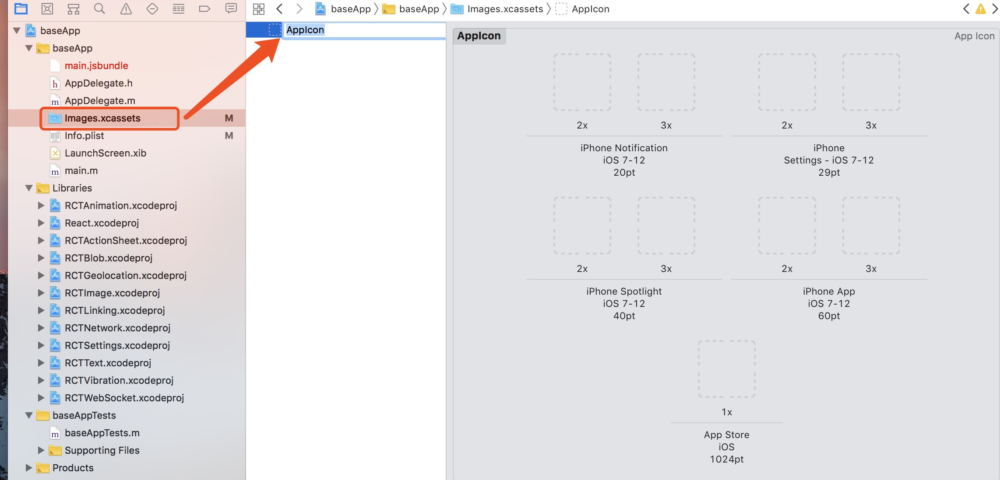

#### 注意：修改完配置之后需重新打包APP

安利一个图标在线生成工具网址：https://icon.wuruihong.com/

###  Mac

###### 1.修改名称

* 没有xcode的童鞋们可以修改 ios/baseApp/info.plist 文件， 如下图所示

代码：
    
    <key>CFBundleDisplayName</key>
    <string>我的APP</string>
    
    
* 使用xCode修改

###### 2.修改APP图标

* 没有xcode的童鞋们可以修改 ios/baseApp/Images.xcassets/AppIcon.appiconset/Contents.json 文件，json代码如下 

    
    {
      "images" : [
        {"size" : "20x20","idiom" : "iphone","filename" : "40x40.png","scale" : "2x"},
        {"size" : "20x20","idiom" : "iphone","filename" : "60x60.png","scale" : "3x"},
        {"size" : "29x29","idiom" : "iphone","filename" : "58x58.png","scale" : "2x"},
        {"size" : "29x29","idiom" : "iphone","filename" : "87x87.png","scale" : "3x"},
        {"size" : "40x40","idiom" : "iphone","filename" : "80x80.png","scale" : "2x"},
        {"size" : "40x40","idiom" : "iphone","filename" : "120x120-1.png","scale" : "3x"},
        {"size" : "60x60","idiom" : "iphone","filename" : "120x120.png","scale" : "2x"},
        {"size" : "60x60","idiom" : "iphone","filename" : "180x180.png","scale" : "3x"},
        {"size" : "1024x1024","idiom" : "ios-marketing","filename" : "1024x1024.png","scale" : "1x"}
      ],
      "info" : {
        "version" : 1,
        "author" : "xcode"
      }
    }
    
    
在 ios/baseApp/Images.xcassets/AppIcon.appiconset/ 目录下上传对应尺寸图标，如下图所示

* 使用xCode ,如下图所示， 拖入对应尺寸图标即可，如图标尺寸拖入不正确，xCode会给出相应提示，替换即可

------------
------------

###  Android

##### 1.修改名称 

android/app/src/main/res/valuse/strings.xml  文件

    <resources>
        <string name="app_name">APP名称</string>
    </resources>

##### 2.修改APP图标

###### 2.1 找到读取APP图标的文件位置

文件目录：android/app/src/main/AndroidManifest.xml

图标引入代码:
    
    android:icon="@mipmap/ic_launcher"   
    android:roundIcon="@mipmap/ic_launcher_round" //圆角图标

###### 2.2 修改图标

将UI切好图标对应尺寸放入对应文件夹，尺寸及文件展示入下图

文件及名称对应

