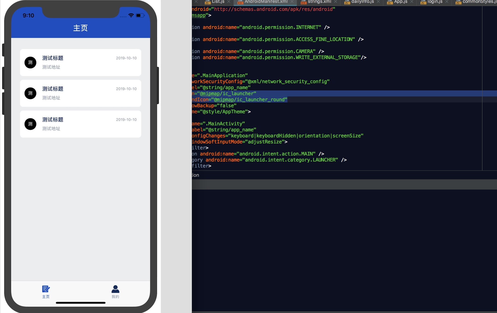

### 项目启动

项目整体架构有待完善，欢迎各位大牛提出宝贵建议，后续本人会一直持续更新，还有对应文档亦会同步更新，求关注，哈哈哈

##### 以下是本人搭建的一套基础框架，可直接从github拉取

#### 1. 运行

     
1.1 从 git 克隆项目到本地开发环境

    git clone https://github.com/dcbase/baseApp.git

1.2 进入项目目录 baseApp
    
    cd baseApp
    
1.3 安装依赖包，及原生依赖
    
    npm install
    
    react-native link  // 安全保障，如有用到原生插件包则需安装平台依赖
    
1.4 项目运行

    react-native run-ios   //运行iOS设备
    
    or
    
    react-native run-android   //运行Android设备
    
  运行完成可看到下图：
  

  
  
  
  

1.5 [可能遇到运行问题](problem/run)

